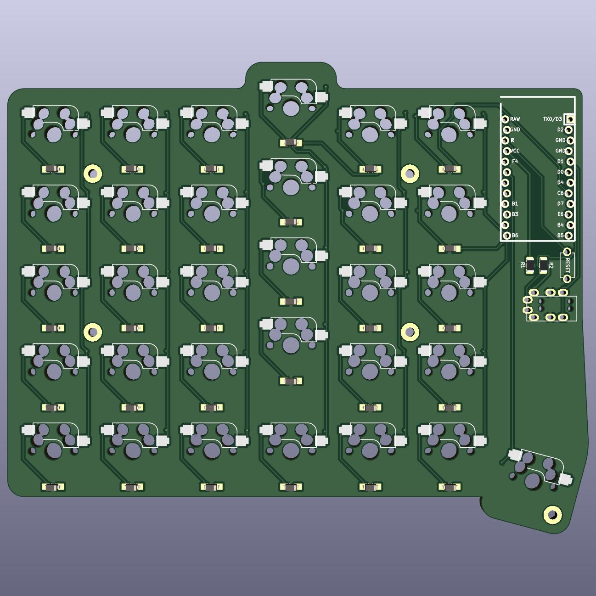

# Palac

Ortholinear 4x6+6 split keyboard with aggressive pinky stagger and a fifth key in the pinky column bottom row. **Work in progress.**

## Overview

Palac came to be as an offshoot of Sofle. The current idea behind it is to create a straightforward split keyboard: no rotary encoders, no backlight, and to explore an additional key in the pinky column bottom row.

My theory is that this key, with other fingers being at their home row positions **and** with my pinky finger length, is more easily reachable by curling the pinky finger compared to the pinky being overextended. This key should be mapped to the least used modifier in my opinion.
